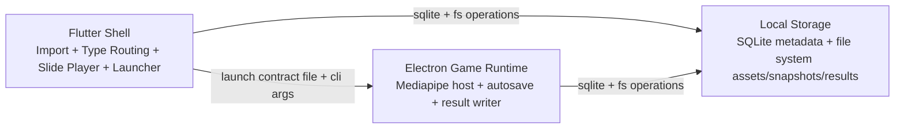

# Eduvi Desktop Offline-Only Architecture

## Assumptions
1. Input is a manually imported `.eduvi` file from local disk.
2. `.eduvi` package type is either `slide` or `game`.
3. Game package contains local web runtime files that can be hosted by Electron without internet.
4. Existing `mediapipe-game` runtime from web is reusable as static local assets.
5. No backend calls are allowed in this architecture.
6. No cloud synchronization is allowed in this architecture.
7. Local machine has permissions to read and write user application data folders.

## Architecture

### System blocks and responsibilities



1. Flutter shell:
   - Import `.eduvi` file.
   - Validate manifest and checksum.
   - Route to slide player or game launcher based on package type.
   - Launch Electron process for game mode.
   - Display resume entry point from local session records.

2. Electron game runtime:
   - Host local `mediapipe-game` runtime in hardened Electron window.
   - Read launch contract generated by Flutter.
   - Load package assets from local extracted directory.
   - Autosave gameplay progress to local storage.
   - Write final game result locally when session ends.

3. Local storage:
   - SQLite stores package/session/result metadata.
   - File system stores extracted package files, snapshots, and runtime logs.
   - Provides crash-safe atomic writes and rollback support.

### How Flutter opens Electron game offline
1. Flutter writes launch contract JSON into local temp folder.
2. Flutter starts Electron executable with arguments:
   - `--launch-contract=<absolute path>`
3. Electron main process validates launch contract and package path.
4. Electron opens local runtime entry HTML and starts game session.

### Flutter-Electron data exchange model
Recommended method: file contract + CLI args (offline-safe, deterministic, replayable).

Contract path is passed by CLI, and all runtime outputs are written back to `outputDir` from contract:
1. `progress.snapshot.json`
2. `game.result.json`
3. `runtime.log`

## Data Flow

### 1) Import `.eduvi`
1. User selects `.eduvi` file in Flutter shell.
2. Flutter computes package checksum and reads manifest.
3. Flutter determines package type (`slide` or `game`).

### 2) Validate package
1. Verify required manifest fields exist.
2. Verify entry files exist in archive.
3. Verify package checksum matches manifest checksum.
4. Reject package with explicit error if invalid.

### 3) Extract package to local storage
1. Extract into temporary directory first.
2. Validate extracted content tree.
3. Atomically rename temp directory into active package directory.
4. On failure: remove temp directory and keep previous valid package unchanged.

### 4) Open slide package
1. Flutter reads slide entry JSON from extracted folder.
2. Flutter renders slides using local assets only.
3. Slide view state is stored in local session row.

### 5) Open game package via Electron
1. Flutter creates session row in SQLite.
2. Flutter writes launch contract (`packagePath`, `sessionId`, `outputDir`, `mode`).
3. Flutter launches Electron process with launch contract path.
4. Electron loads local mediapipe runtime and assets.

### 6) Autosave game progress
1. Runtime emits progress checkpoints.
2. Electron writes atomic snapshot file.
3. Electron updates `progress_snapshots` metadata row.

### 7) Save game result on completion
1. Electron writes result JSON to output directory.
2. Electron inserts `game_results` record in SQLite.
3. Session state becomes `completed`.

### 8) Resume previous session
1. On app startup, Flutter queries latest incomplete game session.
2. If snapshot exists, user can resume.
3. Flutter launches Electron with same `sessionId` and `mode=resume`.
4. Electron restores latest valid snapshot and continues.

## Folder Structure

```text
apps/
  flutter_player/
    lib/
      core/
        app_paths/
        process_launcher/
      features/
        import_eduvi/
        slide_player/
        game_launcher/
        session_resume/
      data/
        local/
        repositories/
      domain/
    test/

  electron_game_runtime/
    electron-main/
      app.ts
      launch-contract-reader.ts
      package-runtime-loader.ts
    electron-preload/
      index.ts
      game-api.ts
    electron-renderer/
      shell/
      runtime-bridge/
    mediapipe-runtime/
      web-runtime/
      local-assets/
    storage/
      snapshot-writer.ts
      result-writer.ts
    test/

packages/
  shared_contracts/
    src/
      launch-contract.ts
      game-result.ts
      progress-snapshot.ts
      validators.ts

  eduvi_schema/
    src/
      eduvi-manifest.ts
      package-parser.ts
      checksum.ts
```

### Dependency direction
1. `packages/eduvi_schema` has no dependency on app modules.
2. `packages/shared_contracts` depends only on primitive/shared types.
3. `apps/flutter_player` depends on both package modules.
4. `apps/electron_game_runtime` depends on both package modules.
5. `apps/flutter_player` and `apps/electron_game_runtime` do not depend on each other directly.

This prevents circular dependencies and keeps app boundaries clean.

## Local Storage Schema

### Local storage root

```text
<user_data_root>/EduviOffline/
  packages/
    <package_id>/
      <version>/
        extracted/
        manifest.json
        package.checksum
  sessions/
    <session_id>/
      progress.snapshot.json
      game.result.json
      runtime.log
  db/
    eduvi_offline.db
    eduvi_offline.db-wal
    eduvi_offline.db-shm
  temp/
  logs/
```

### SQLite tables (minimum)
1. `packages`
   - tracks installed packages and extracted locations.
2. `sessions`
   - tracks slide/game session lifecycle.
3. `progress_snapshots`
   - tracks autosave checkpoints.
4. `game_results`
   - stores completed game result records.
5. `app_settings`
   - stores local app preferences and defaults.

### Keys and index rationale
1. `packages`
  - PK: `package_id` for stable package identity.
  - Index: `(package_type, is_active)` to quickly list active slide/game packages.

2. `sessions`
  - PK: `session_id` for unique session lookup.
  - FK: `package_id -> packages.package_id` to prevent orphan sessions.
  - Index: `(package_id, started_at desc)` for recent sessions by package.

3. `progress_snapshots`
  - PK: `snapshot_id` for unique checkpoint lookup.
  - FK: `session_id -> sessions.session_id` for cascade delete on removed session.
  - FK: `package_id -> packages.package_id` to keep package linkage explicit.
  - Index: `(session_id, created_at desc)` for fast latest snapshot query on resume.

4. `game_results`
  - PK: `result_id` for immutable result identity.
  - FK: `session_id -> sessions.session_id` for strict session-result relation.
  - FK: `package_id -> packages.package_id` for package-level reporting.
  - Index: `(package_id, completed_at desc)` for result history by package.

5. `app_settings`
  - PK: `setting_key` for upsert-friendly key-value settings storage.

Full SQL definition is in `shared-contracts/schema/offline-sync.sqlite.sql`.

## Contracts

### Minimal eduvi manifest

```json
{
  "schemaVersion": "1.0.0",
  "packageId": "pkg_math_001",
  "packageType": "game",
  "title": "Math Reflex",
  "version": "1.2.0",
  "entryFile": "runtime/index.html",
  "checksumSha256": "...",
  "assets": [
    {
      "path": "runtime/models/pose_landmarker.task",
      "sha256": "...",
      "size": 7340032
    }
  ]
}
```

### Game result json

```json
{
  "resultId": "res_01",
  "sessionId": "ses_01",
  "packageId": "pkg_math_001",
  "status": "completed",
  "score": 920,
  "durationMs": 185000,
  "accuracy": 0.94,
  "completedAt": "2026-04-20T10:30:00Z",
  "detail": {
    "correct": 47,
    "wrong": 3
  }
}
```

### Progress snapshot json

```json
{
  "snapshotId": "snap_01",
  "sessionId": "ses_01",
  "packageId": "pkg_math_001",
  "levelId": "level_3",
  "checkpoint": "cp_7",
  "score": 640,
  "timerMsRemaining": 43000,
  "state": {
    "combo": 4,
    "lives": 2
  },
  "createdAt": "2026-04-20T10:21:00Z",
  "checksumSha256": "..."
}
```

### Launch contract between Flutter and Electron

```json
{
  "packagePath": "D:/EduviOffline/packages/pkg_math_001/1.2.0/extracted",
  "sessionId": "ses_01",
  "outputDir": "D:/EduviOffline/sessions/ses_01",
  "mode": "resume"
}
```

Mandatory fields:
1. `packagePath`
2. `sessionId`
3. `outputDir`
4. `mode`

## Phase Plan

Detailed task-by-task plan is stored in:
`docs/superpowers/plans/2026-04-20-offline-desktop-game-implementation.md`

Summary:
1. Phase 1: Flutter shell + eduvi import.
2. Phase 2: Slide renderer offline.
3. Phase 3: Electron runtime for mediapipe game.
4. Phase 4: Autosave + resume.
5. Phase 5: Local DB + package/session manager.

## Test Plan

1. Unit tests:
   - eduvi parser.
   - checksum validator.
   - local repository and file storage.
2. Integration tests:
   - import -> validate -> extract -> open slide.
   - import -> validate -> extract -> launch Electron -> autosave -> save result.
3. Test matrix by package type:
   - slide package path.
   - game package path.
4. Crash recovery test:
   - force close during gameplay.
   - restart app.
   - verify resume uses latest valid snapshot and no metadata corruption.

## Risks and Mitigations

1. Risk: damaged eduvi package causes partial extraction.
   - Mitigation: extract to temp folder, validate, atomic rename, rollback on failure.
2. Risk: snapshot corruption on crash.
   - Mitigation: atomic writes with temp file + checksum validation + previous snapshot fallback.
3. Risk: Electron attack surface in local runtime.
   - Mitigation: contextIsolation enabled, nodeIntegration disabled, preload whitelist only.
4. Risk: package size growth from mediapipe assets.
   - Mitigation: per-package versioned storage and cleanup policy for old versions.
5. Risk: accidental internet dependency from runtime scripts.
   - Mitigation: static scan for remote URLs and block runtime network access by policy.
